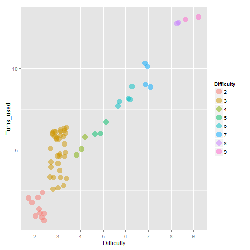

The Shiny Memory Match Game
========================================================
author: Yang
date: 2014-08-21

Intruduction
========================================================

Picture matching game is a very famous memory challenge game that player click on the different cards to find pairs of matching pictures. 

In this simple [Shiny deploy of matching game](http://doubletang.shinyapps.io/shiny_course_project/), digits (from 1 to 9) are used instead of pictures. The player's mission is to uncover all the pairs of digits using as few guesses as possible. 

App Structure
========================================================

This Shiny App contains three mainpages:
- [Game](#/game): The matching game interface 
- [Table](#/table_plot): The data records of games ever played
- [Plot](#/table_plot): The plot of game data

The source codes are hosted on [github](https://github.com/doubletang/shiny_course_project)

The Game Page
========================================================
id: game

In this game page, the users can play a matching game at differect levels of difficulties.

As shown on the right, random shuffled digits are masked as "X", when player click on them, the digits are showed temporarily. The player keeps on matching the digits until all the pairs of digits are discovered.

***

The Table and Plot Page
========================================================
id: table_plot

The table and plot pages record the data of games ever played and show as a plot.

***

 

